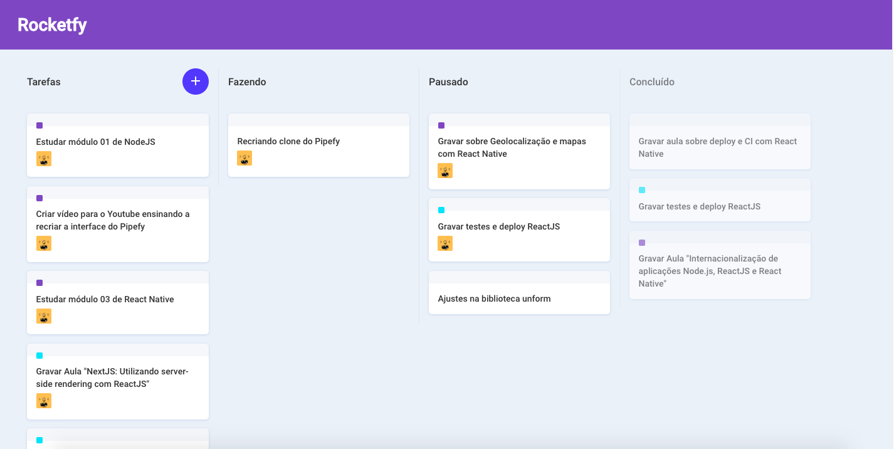

This project was bootstrapped with [Create React App](https://github.com/facebook/create-react-app).
Building clone interface Pipefy, using React js, library react-dnd, immer and React Context API. 
All credits video tutorial
Youtube Channel RocketSeat, Teacher Diogo Fernandes.
Link: https://youtu.be/awRtgpRsdTQ
RocketSeat: https://rocketseat.com.br/ 

  

## Link Demo below:
https://alexgomesnet3.github.io/rocketfy/

## Available Scripts to Install and Run Project

In the project directory, you can run:

### `npm install`
### `npm start`

Runs the app in the development mode. 
Open [http://localhost:3000](http://localhost:3000) to view it in the browser.

Thank you!
